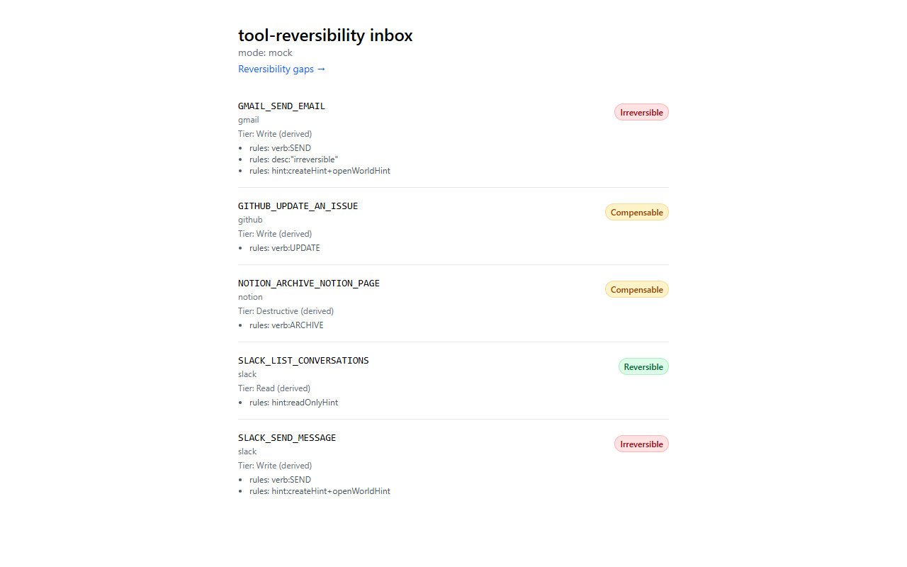
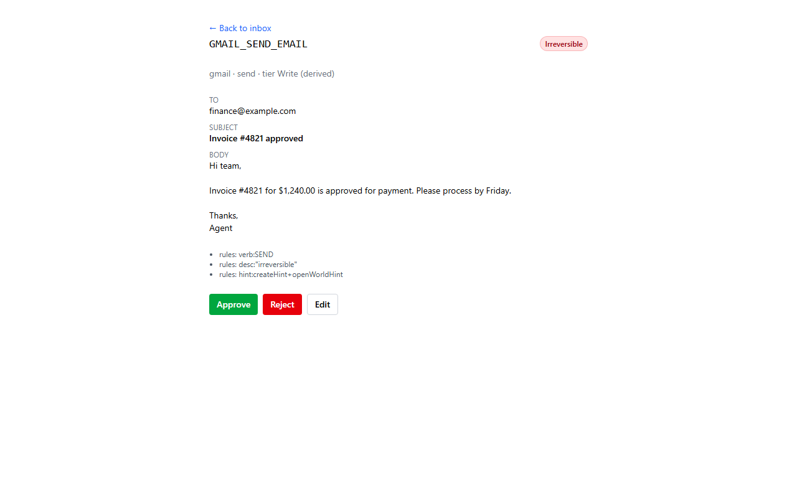
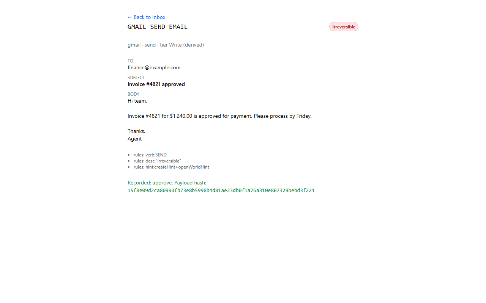
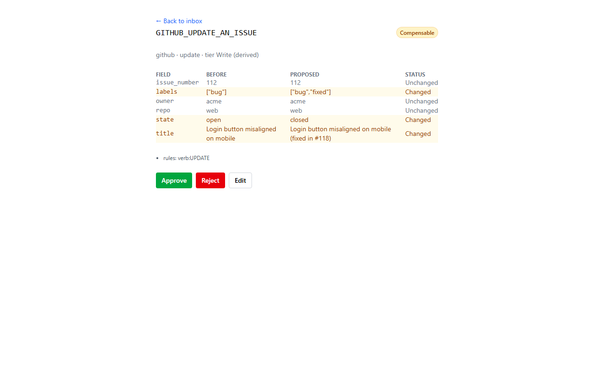

# tool-reversibility

**Can this agent action be undone?**

When an agent acts through Composio, the gate on each call is whatever Composio knows about that
tool. Today that is a set of MCP-style behaviour hints (`readOnlyHint`, `destructiveHint`,
`idempotentHint`, `openWorldHint`, `createHint`, `updateHint`, `important`), plus the Read / Write
/ Destructive tier that Enhanced Controls (beta) adds. Neither says whether an action can be
undone. Sending an email, posting to Slack or paying an invoice deletes nothing, so it isn't
"destructive", yet none of them can be taken back.

`tool-reversibility` pulls the whole Composio tool catalog and classifies every tool as
**reversible / compensable / irreversible** with two classifiers (rules and an LLM, both cached),
compares that against the hints Composio already ships, and publishes the gap. It also ships an
approval-inbox demo of what an "ask" step looks like when reversibility is known, and a
data-backed proposal for an `irreversibleHint` ([PROPOSAL.md](PROPOSAL.md)).

Write-up: [Can this agent action be undone?](docs/WRITEUP.md)

Not affiliated with Composio. MIT licensed.






_The mock inbox: pending actions, a send preview, an approve confirmation, and an update diff._
A GIF/Loom walkthrough is a user step (not automated here).

## Headline

> Of [[pending live run]] tools that both classifiers call irreversible, [[pending live run]]
> ([[pending live run]]%) carry neither `destructiveHint` nor any tag that moves them out of the
> Write tier, e.g. `GMAIL_SEND_EMAIL`.

The numbers are filled in only from a stamped, reproducible run:
[reports/REPORT.md](reports/REPORT.md) (rules-only for now). Until the paid LLM pass has run
live, the headline stays `[[pending live run]]`. How numbers are stamped and checked:
[docs/stamping.md](docs/stamping.md).

What is already verified, from the full catalog fetch
[snapshot 2026-09-24, @composio/core 0.21.0](skilleddocs/plan.md): 1,562 toolkits and 56,216 tools, 659 of them deprecated.
`GMAIL_SEND_EMAIL` is tagged `important`, `openWorldHint` and `createHint`, and has no
`destructiveHint` [snapshot 2026-09-24, @composio/core 0.21.0](skilleddocs/plan.md).

## How it works

`packages/audit` is a CLI: **fetch → classify (rules, LLM) → compare → report**.

- **fetch** snapshots every toolkit's tools (public catalog metadata only) into
  `fixtures/catalog/<date>/`, with a manifest recording the SDK version, date, command and counts.
- **hints** maps each tool's tags to the seven hint booleans and derives a Read / Write /
  Destructive tier from them. The tier is labelled **derived**: the SDK doesn't expose the real
  Enhanced Controls tier.
- **rules** is a pure, table-tested classifier over the slug verb, description and schema.
- **LLM** sends tools through the Anthropic Message Batches API with a structured-output schema
  (prompt `prompts/classify.v1.md`), caching one result per tool so re-runs are free.
- **compare / report** marks a tool as a **gap** when both classifiers call it
  irreversible and it has no `destructiveHint`, and writes the stamped report.

`apps/inbox` is a Next.js approval inbox for "ask" actions: a reversibility badge, a payload diff
or rendered send preview, Approve / Reject / Edit, and an append-only audit log. Mock mode (fixtures,
zero keys) is the default; live mode (`INBOX_MODE=live`) proposes and executes real Composio
actions through a session, with approval before anything runs.

## Reproduce

Needs Node 22+ and pnpm 10 (`corepack enable`). `pnpm audit` is pnpm's own security scanner, so
the CLI lives under `pnpm audit:cli` (same as `pnpm --filter audit start --`).

```sh
pnpm i --frozen-lockfile
pnpm audit:cli --help
```

### Try it in 60 s, zero keys

No `COMPOSIO_API_KEY`, no `ANTHROPIC_API_KEY`, no network:

```sh
pnpm i --frozen-lockfile
pnpm audit:cli all --offline
```

`all --offline` skips fetch, runs `classify --rules` against the committed
`fixtures/catalog/trimmed` fixture, then `report`. Output lands in `reports/offline/`
(`REPORT.md`, `report.json`, `full/tools.csv`), which is gitignored — the committed
`reports/REPORT.md` and `reports/report.json` are never touched. Pass `--out <dir>` to write
somewhere else instead.

**1. Fetch the catalog.** Needs `COMPOSIO_API_KEY` in `.env` at the repo root (see
`.env.example`; never logged). Free-tier catalog GETs only.

```sh
pnpm audit:cli fetch                           # all toolkits -> fixtures/catalog/<YYYY-MM-DD>/ (gitignored)
pnpm audit:cli fetch --toolkits gmail,slack    # only these toolkits
pnpm audit:cli fetch --refresh                 # re-fetch toolkits already on disk (default: resume)
```

**2. Estimate the LLM cost first.** No spend happens without an explicit yes on this number
(`--dry-run` builds no client and reads no key):

```sh
pnpm audit:cli classify --llm --dry-run                                      # committed trimmed fixture
pnpm audit:cli classify --llm --dry-run --snapshot fixtures/catalog/<date>   # the full snapshot
```

It prints the tool and request counts, estimated tokens and the Batch-priced dollar cost for
`claude-sonnet-5` and `claude-opus-5`. Only after approving that cost:
`pnpm audit:cli classify --llm --live --snapshot fixtures/catalog/<date>` (needs
`ANTHROPIC_API_KEY`). Without `--live`, `classify --llm` only reads the cache.

**3. Build the report.** `pnpm audit:cli report` writes `reports/REPORT.md` and
`reports/report.json`, stamped with date, commit, SDK version, model, LLM status, prompt version,
manifest hash and the regenerate command. Pass `--snapshot fixtures/catalog/<date>` for the full
catalog. LLM columns come from the cache only, and only `live` entries count: until the approved
live pass exists, every LLM-dependent number is `[[pending live run]]` (plan.md D31). The full
per-tool CSV goes to `reports/full/tools.csv` (gitignored).

**4. Explain one tool.** `pnpm audit:cli explain <SLUG>` is a single-tool deep-dive: no network, no
LLM calls, reads the local snapshot and the on-disk LLM cache only.

```sh
pnpm audit:cli explain GMAIL_SEND_EMAIL --snapshot fixtures/catalog/trimmed
```

Prints the toolkit; the raw `tags[]` mapped onto the 7 known hints via `deriveHints` (plus any
unknown raw tags); the derived tier (`deriveTier`, always "derived" — D20/D22); the rule
classifier's class/confidence/reasons (`classifyTool`); the LLM cache state for the current model
(`--model`, else `$CLASSIFIER_MODEL`, else `claude-sonnet-5`) and `PROMPT_VERSION` — `live` (a real
Batches verdict), `recorded` (labelled `recorded-synthetic — NOT a model verdict`, D31: never
presented as the LLM's own class), or `miss`; the GAP and single-gap flags (D2; a recorded cache
entry never counts toward GAP); and the spot-check label + rationale when the slug is hand-labelled
in `fixtures/labels/spotcheck.json`. An unknown slug exits 2 and lists the 5 closest slugs. Pass
`--json` for the same data as JSON.

**Current CLI state** (see `packages/audit/src/program.ts`, `classifyCommand.ts`):

| command            | status                                                                                                                                                      |
| ------------------ | ----------------------------------------------------------------------------------------------------------------------------------------------------------- |
| `fetch`            | works (resumable, backoff on 429/5xx, REST fallback where the SDK rejects a payload)                                                                        |
| `classify --llm`   | works: `--dry-run` cost gate, cache replay, `--live` Batches submission behind the key and approval                                                         |
| `classify --rules` | works: rule classifier table (`rules.ts`) with derived tier; default `classify` runs rules then LLM                                                         |
| `report`           | works: stamped `reports/REPORT.md` + `report.json`; rules-only until a live LLM pass (D31)                                                                  |
| `all`              | works: fetch -> `classify --rules` -> report, stops at the first failure; `--offline` skips fetch and writes to `reports/offline/`; `--live`/`--llm` exit 2 |
| `explain <slug>`   | works: hints/tier/rule/LLM-cache-state/GAP for one tool, offline (cache + snapshot only); `--json` for machine-readable output                              |

Online `all` (no `--offline`) regenerates the committed `reports/REPORT.md` and `report.json` by
design; there `--out` is the fetch snapshot dir, not the report dir (plan.md D45).

### Mock inbox (zero keys)

```sh
pnpm --filter inbox dev     # http://localhost:3000
```

Mock mode (`INBOX_MODE=mock`) is the default. It reads the pending actions in
`fixtures/pending/*.json` (real catalog slugs and field names, illustrative values) and the committed
`reports/report.json` (rules-only until the live LLM run). Details:
[apps/inbox/README.md](apps/inbox/README.md).

### Live inbox (optional)

```sh
INBOX_MODE=live COMPOSIO_API_KEY=<your key> pnpm --filter inbox dev
```

A "Propose a live action" form queues a real tool call; Approve runs it via `session.execute`,
Reject and Edit only log. Pending rows and the audit log live in `apps/inbox/.data/live.db`
(`node:sqlite`, needs Node >=22.13). A failure shows a banner and falls back to fixtures. Approve
sends for real, so use a test account. Details:
[apps/inbox/README.md#live-mode](apps/inbox/README.md#live-mode).

**Demo: `pnpm demo:agent` then `INBOX_MODE=live pnpm --filter inbox dev` shows the proposal.** A
scripted, no-LLM agent gets its tools via `session.tools({ beforeExecute: approvalGuard })` and
tries `GMAIL_SEND_EMAIL` to a placeholder address; the guard throws and queues a pending row in
`apps/inbox/.data/live.db` (override: `DEMO_DB=<any path>` or `--db <any path>`). The default session
is a mock of `@composio/core` 0.21.0's execute path (no key, no network); `--live` uses a real
session and needs `COMPOSIO_API_KEY`. Listing needs no key; Approve without a key shows a banner
and the row stays pending (plan.md D43).

## Run on Replit

[](https://replit.com/new/github/KrishP147/tool-reversibility)

**Import.** Click the badge (or Replit -> Create -> Import from GitHub -> this repo). Replit reads
the committed [`.replit`](.replit) (`nodejs-22`, `pnpm --filter inbox dev` for the workspace run
button, a Cloud Run deployment target). No `replit.nix` and no secrets are needed for this step.

**Deploy.** In the Replit workspace: Deploy -> Autoscale. Build command and run command come from
`.replit`'s `[deployment]` block (`pnpm i --frozen-lockfile && pnpm --filter inbox build`, then
`pnpm --filter inbox start`, which binds `next start` to `0.0.0.0:$PORT`). Port 3000 is mapped to
the public port 80. **Mock mode is the default and the deploy needs zero secrets** — the deployed
inbox reads the committed fixtures and report exactly like local `pnpm --filter inbox dev`.

**Live mode (optional).** Add two Replit Secrets on the deployment: `INBOX_MODE=live` and
`COMPOSIO_API_KEY=<your key>`. Never put these in `.replit`, `.env`, or a commit. See
[apps/inbox/README.md](apps/inbox/README.md#live-mode) for what live mode does and its one
gap.

**Deployed URL:** TODO(Krish) — fill in after the first Deploy (date: TODO).

**90s Loom script** (timestamped beats for whoever records it):

- `0:00-0:15` — Open the README headline and `PROPOSAL.md`: the problem (hints don't say
  "undoable") in one breath.
- `0:15-0:35` — Deployed inbox, list view: point at an irreversible-badged row (e.g.
  `GMAIL_SEND_EMAIL`) with no `destructiveHint`, i.e. the gap.
- `0:35-0:55` — Open its detail view: payload preview, compensating tool (if any), Approve /
  Reject / Edit.
- `0:55-1:15` — Click Approve, show the audit log entry it just wrote (who/when/decision/hash).
- `1:15-1:30` — Close on `.replit`/README: mock-by-default, zero secrets, live mode is opt-in
  behind Replit Secrets.

## Limitations

- **Our classification is not ground truth.** Reversible / compensable / irreversible is our
  judgement from each tool's name, description and schema. The report shows how often the rules
  and the LLM disagree ([[report:agreement.rate]] agreement) and scores the rules against a
  hand-labelled spot-check set, labelled blind and pending Krish's review:
  74 tools, "irreversible" precision 0.667, recall 0.8 [report 2026-09-24, commit a9d50c0].
  See [reports/REPORT.md](reports/REPORT.md).
- **The tier is derived, not Composio's.** Neither the SDK nor the REST tool objects expose the
  Enhanced Controls tier, so it is derived from the hints (plan.md D22). The real mapping may
  differ per slug (ComposioHQ/composio#4327).
- **Rules only until the live run.** The LLM pass costs money and waits on approval, so until it
  runs every LLM-dependent number here is `[[pending live run]]`.
- **The committed LLM cache is synthetic.** `fixtures/llm-cache/` for the trimmed fixture was
  replayed from a labelled slug-verb heuristic, not model output. Every entry is stamped
  `provenance: "recorded"`; dry runs and `--live` treat them as misses, and no reported number
  may come from them.
- **The trimmed fixture is a sample.** `fixtures/catalog/trimmed/` keeps a few tools per toolkit
  for tests and CI; it is not the catalog.
- **Live mode's intercept is a client-side hook, not a server-side gate.** It only catches calls
  routed through `session.tools()`'s `modifiers.beforeExecute` (plan.md §3b); an agent that calls
  `session.execute()` directly, or any caller outside this SDK session, bypasses it entirely. This
  is a "proposal queue" pattern (the caller opts in to being intercepted), not a policy enforced by
  Composio itself. It also only fires through an agentic provider's wrapped tools. The only agent
  wired to it is the scripted `pnpm demo:agent` (mock session by default); the web UI queues
  proposals through its Propose form instead.

## Origin: Zephyr

The idea comes from **Zephyr** ([github.com/KrishP147/Zephyr](https://github.com/KrishP147/Zephyr),
Devpost: TODO(Krish)), built at Hack the North 2026, where it made the top 12 of the Warp track.
Zephyr hand-gated `GMAIL_SEND_EMAIL` as irreversible, and its Devpost feedback asked Composio for
exactly this flag.

Zephyr was a team project. **Krish owned:**

- the self-improving workflow optimizer: it critiques run history against a single-call baseline
  and proposes a forked, reviewable graph that cannot grade itself;
- the human-in-the-loop approval fixes: revised actions are re-authorized and may only narrow
  scope, runs pause and resume, and a blocked completion pauses for a human;
- the Connections page: Composio, generic MCP servers and a reviewed tool inventory;
- the sponsor integrations (a Gemini route, a GPTZero check, Sentry), each behind a mock twin;
  the Gemini and GPTZero paths were not run live at submission.

The core runtime, the Hermes adapter, the tool registry, the browser family and the provider
pipeline were teammates' work.

## Development

pnpm workspaces monorepo: `packages/audit` (CLI) and `apps/inbox` (Next.js demo). Node 22+
(`.nvmrc`; inbox live mode needs >=22.13), pnpm 10.28.1 (`packageManager`; CI reads it via `pnpm/action-setup`).

```sh
pnpm i --frozen-lockfile
pnpm -r lint
pnpm -r test
pnpm -r build
pnpm check:stamped   # docs cite every Composio number (docs/stamping.md)
pnpm format:check    # or `pnpm format` to write
```

Regenerate the README screenshots (`docs/img/*.png`; builds the inbox, runs it in mock mode with a
temp audit dir via `INBOX_AUDIT_DIR`, drives headless Chromium; needs
`pnpm --filter inbox exec playwright install chromium` once):

```sh
pnpm --filter inbox screenshots
```

Regenerate the committed trimmed fixture:

```sh
pnpm audit:cli fetch --toolkits gmail,slack,github,googlecalendar,notion --out fixtures/catalog/trimmed --max-tools 25 --refresh
```

Tests use fake clients and recorded responses and need no keys. The live fetch test is opt-in:
`AUDIT_LIVE=1 pnpm --filter audit test`. No secrets are needed to lint, test or build; CI runs
gitleaks on every push and PR. Design record: [skilleddocs/plan.md](skilleddocs/plan.md).

## License

MIT, see [LICENSE](LICENSE). Not affiliated with Composio.
